# PlainFit Fitness Tracker

## Description

A simple fitness tracker with export to CSV

## Screenshots

### Light Mode

    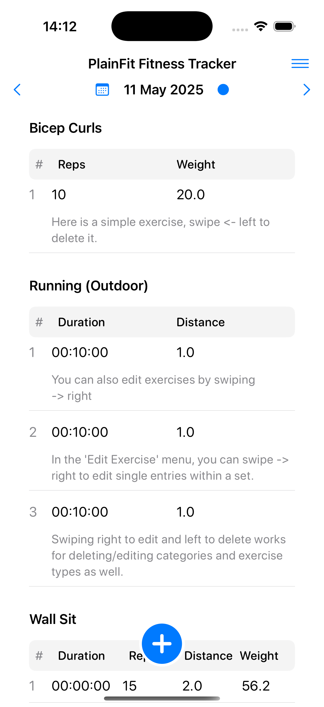&nbsp;&nbsp;
    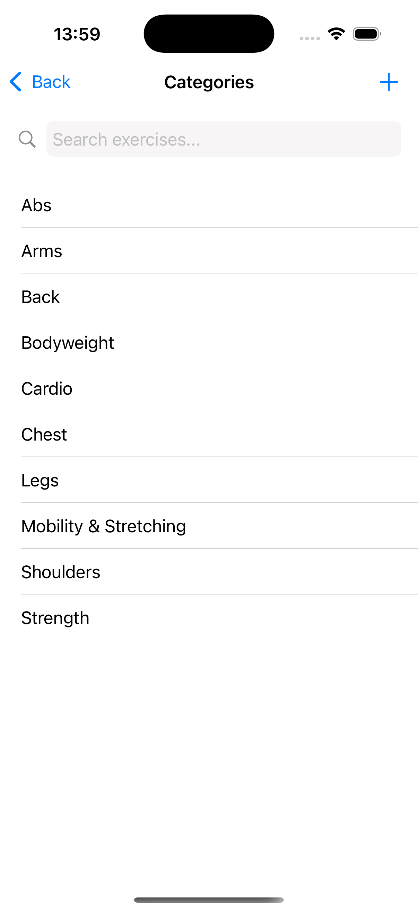&nbsp;&nbsp;
    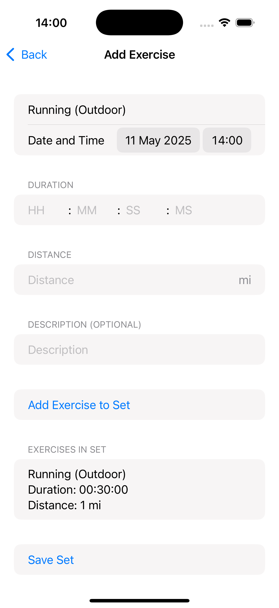&nbsp;&nbsp;
    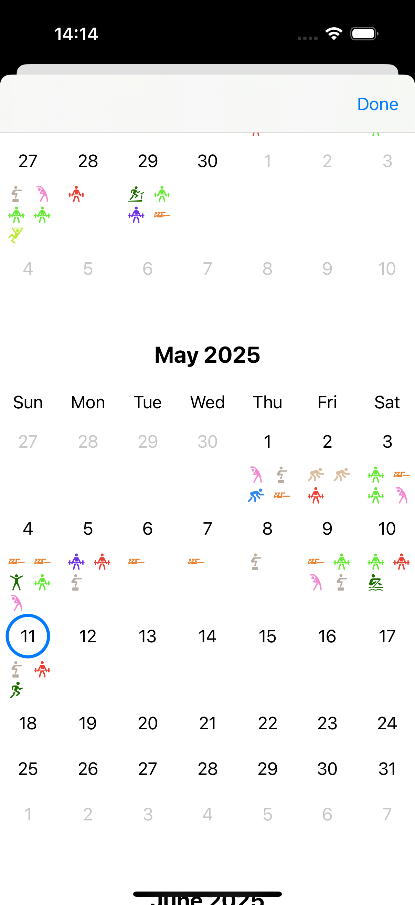&nbsp;&nbsp;
    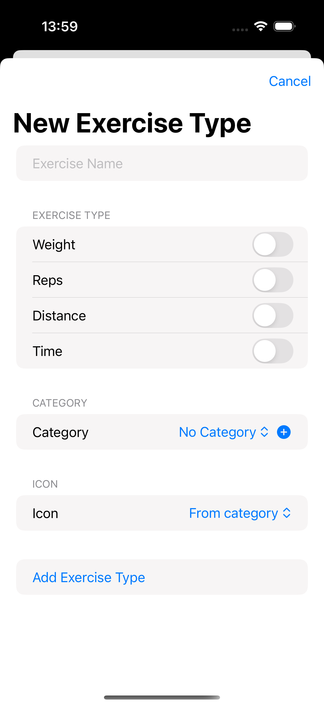&nbsp;&nbsp;
    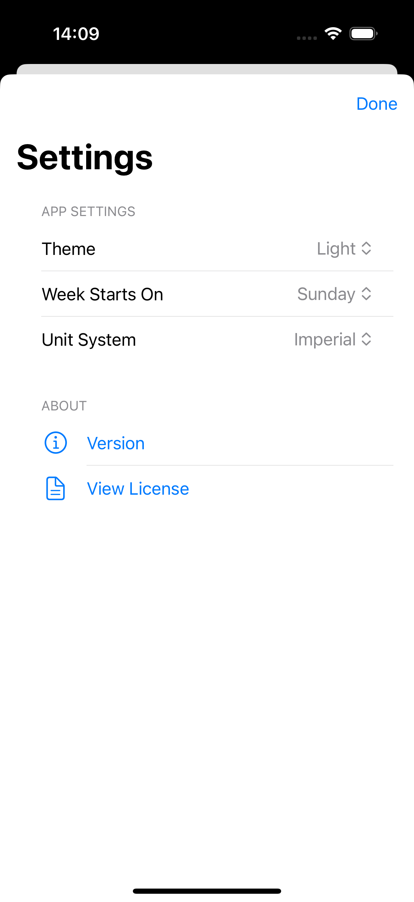&nbsp;&nbsp;

### Dark Mode

    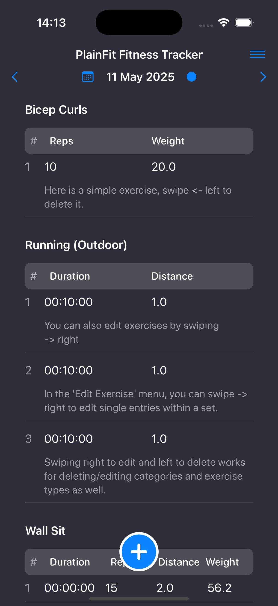&nbsp;&nbsp;
    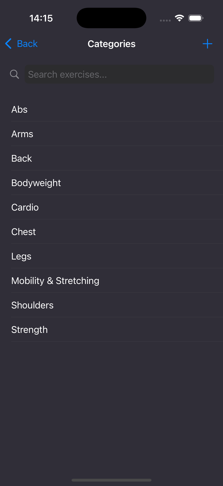&nbsp;&nbsp;
    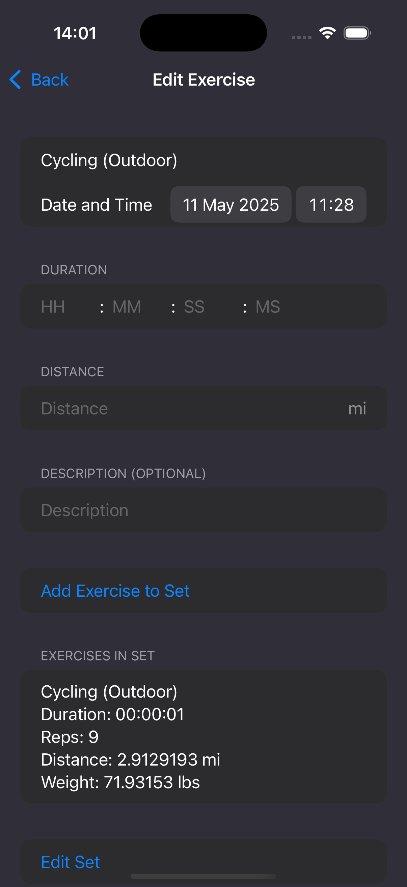&nbsp;&nbsp;
    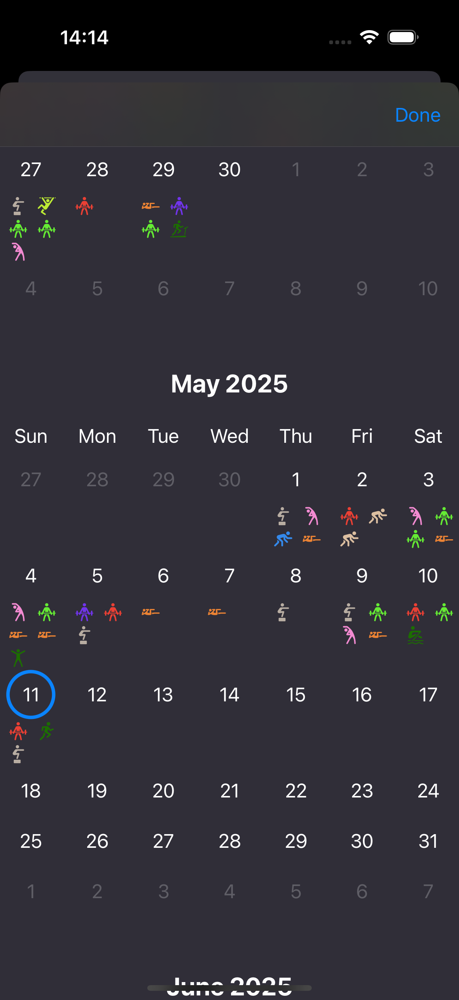&nbsp;&nbsp;
    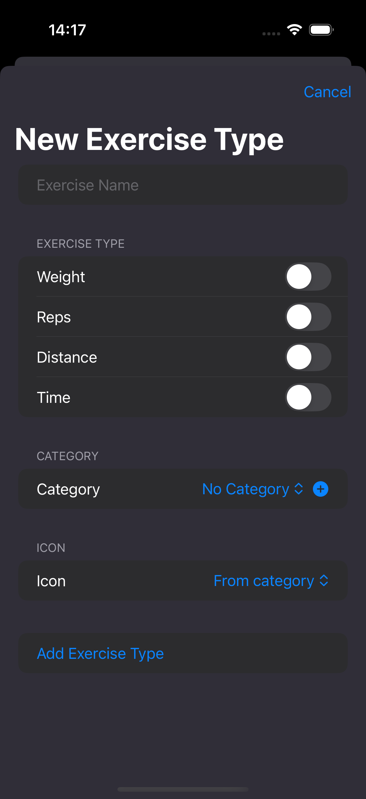&nbsp;&nbsp;
    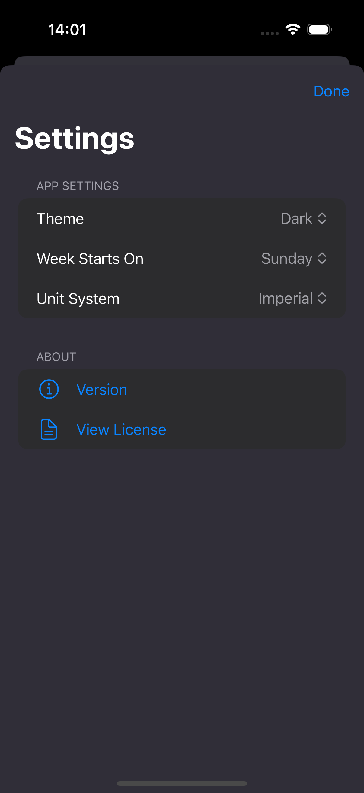&nbsp;&nbsp;

## License
GPL-3.0 license
